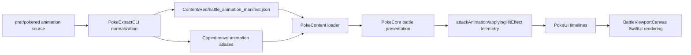

# Battle Animation Pipeline

This document explains how battle attack animations work in PokeSwift, from the original Game Boy source data all the way to the native SwiftUI battle viewport.

It is written as a technical walkthrough rather than a terse API reference. The goal is to help a human understand the full pipeline, why it is shaped this way, and where each responsibility lives.

## Why This Exists

The battle animation system is intentionally split across multiple modules:

- `PokeExtractCLI` reads and normalizes the original `pret/pokered` animation source.
- `PokeDataModel` defines the runtime-friendly schema.
- `PokeContent` loads the extracted JSON and validates that the needed atlases exist.
- `PokeCore` decides when an animation should play during battle presentation.
- `PokeUI` interprets the extracted commands into SwiftUI-friendly keyframes and renders them.

That split is important because this project does **not** parse Game Boy `.asm` files at runtime. The runtime only consumes extracted artifacts from `Content/Red/`.

## The Big Picture

At a high level, the flow looks like this:

There are really two related systems now:

- Move-specific animation playback, extracted from the Game Boy data.
- Generic post-hit feedback, modeled separately as `applyingHitEffect` to match GB battle cadence.

The first is source-driven data. The second is a runtime presentation descriptor derived from battle semantics.

## 1. Reading The Original Game Boy Source

The extraction entry point is `Sources/PokeExtractCLI/BattleAnimationExtraction.swift`.

The extractor reads a fixed set of source files from `pret/pokered`, including:

- `data/moves/animations.asm`
- `data/battle_anims/subanimations.asm`
- `data/battle_anims/frame_blocks.asm`
- `data/battle_anims/base_coords.asm`
- `data/battle_anims/special_effect_pointers.asm`
- `constants/move_animation_constants.asm`
- `engine/battle/animations.asm`
- the move animation atlases like `gfx/battle/move_anim_0.png`

Those files collectively describe:

- which animation command stream belongs to each move
- which subanimation pointer belongs to each symbolic animation id
- which frame block belongs to each subanimation step
- which base coordinate set should anchor each step
- which special-effect routine names are referenced by the animation script
- which tileset image contains the tiles used by that animation

### Move Animations Are Command Streams

The extractor first determines the move order from `data/moves/moves.asm`, then matches that move order against the `AttackAnimationPointers` table in `data/moves/animations.asm`.

For each move, it builds a `BattleMoveAnimationManifest`:

- `moveID`
- `commands: [BattleAnimationCommandManifest]`

Each command is normalized into one of two kinds:

- `subanimation`
- `specialEffect`

A `subanimation` command carries:

- an optional `soundMoveID`
- a `subanimationID`
- a `tilesetID`
- a `delayFrames`

A `specialEffect` command carries:

- an optional `soundMoveID`
- a `specialEffectID`

This is the key design choice: instead of preserving raw assembly syntax, the extractor turns the GB animation script into a typed command stream that Swift can execute deterministically.

### Subanimations Become Reusable Step Lists

The Game Boy data reuses many small animation building blocks. The extractor reads subanimation ids and pointer labels, then emits `BattleSubanimationManifest` values.

Each subanimation contains:

- `id`
- `transform`
- `steps`

Each step points at:

- a `frameBlockID`
- a `baseCoordinateID`
- a `frameBlockMode`

So a move animation is not "a list of pixels." It is closer to "play this reusable subanimation with this transform and this timing."

### Frame Blocks Become Tile Placements

Frame blocks are the closest thing to sprite draw commands. They eventually become `BattleAnimationFrameBlockManifest`, which contains a list of `BattleAnimationFrameTileManifest` records.

Each tile manifest includes:

- `x`
- `y`
- `tileID`
- `flipH`
- `flipV`

This is the data the renderer ultimately turns into a tile overlay in the battle viewport.

### Base Coordinates Become Anchor Points

The extractor also reads the battle animation base coordinate table and emits `BattleAnimationBaseCoordinateManifest`:

- `id`
- `x`
- `y`

These coordinates are effectively the base anchor for a frame block before tile offsets and transforms are applied.

### Special Effects Stay Symbolic

Not everything in Red's animation engine is a tile overlay. Some commands trigger routines like screen flash, darkening, attacker movement, or sprite blinking.

Instead of flattening those into pixels during extraction, the extractor records them symbolically as `BattleAnimationSpecialEffectManifest`:

- `id`
- `routine`

That lets the UI interpreter decide what SwiftUI-side visual state corresponds to a given GB effect routine.

### Tilesets Become Manifest Entries Plus Copied PNGs

The extracted animation manifest also contains `BattleAnimationTilesetManifest` records:

- `id`
- `tileCount`
- `imagePath`

At extraction time, `RedContentExtractor` also copies the real atlas PNGs into `Content/Red/Assets/battle/animations/`.

So the runtime gets both:

- structured animation metadata in `battle_animation_manifest.json`
- the corresponding atlas images that contain the actual tiles

## 2. Writing Runtime Artifacts

The integration point is `Sources/PokeExtractCLI/RedContentExtractor.swift`.

During extraction, `RedContentExtractor.extract(configuration:)` calls `extractBattleAnimationManifest(source:)` and writes the result to:

- `Content/Red/battle_animation_manifest.json`

It also copies:

- `gfx/battle/move_anim_0.png` -> `Assets/battle/animations/move_anim_0.png`
- `gfx/battle/move_anim_1.png` -> `Assets/battle/animations/move_anim_1.png`

This is the exact boundary the project wants:

- extraction is allowed to know about `.asm`
- runtime is not

## 3. Loading The Animation Manifest At Runtime

`Sources/PokeContent/Loading/ContentLoading.swift` loads `battle_animation_manifest.json` alongside the other extracted manifests.

The file-system loader does two important things here:

1. It decodes `BattleAnimationManifest`.
2. It verifies that the referenced animation atlases actually exist on disk.

The loaded manifest is then stored inside `LoadedContent` in `Sources/PokeContent/Loading/LoadedContent.swift`.

`LoadedContent` exposes convenience lookups like:

- `battleAnimation(moveID:)`
- `battleAnimationSubanimation(id:)`
- `battleAnimationFrameBlock(id:)`
- `battleAnimationBaseCoordinate(id:)`
- `battleAnimationSpecialEffect(id:)`
- `battleAnimationTileset(id:)`

That means the rest of the app never scans JSON manually. It just asks `LoadedContent` for typed battle animation data.

## 4. Runtime Presentation: Deciding What To Play

The runtime battle presentation logic lives in `Sources/PokeCore/Runtime/Battle/GameRuntime+BattlePresentation.swift`.

This layer does **not** draw anything. Its job is to decide:

- what beat comes next
- how long it should last
- whether it needs user confirmation
- which side is active
- whether a move-specific animation should play
- whether a generic post-hit effect should play

### `makeBeats(for:)` Is The Core Bridge

The main bridge between battle simulation and UI playback is `makeBeats(for:)`.

Given a `ResolvedBattleAction`, it turns one resolved move into a sequence of presentation beats.

Today that sequence looks roughly like:

1. used-move text beat
2. move animation beat
3. generic applying-hit effect beat
4. HP drain or status/result beat
5. trailing result text beats

This is where the project moved away from the original placeholder model of "just do `.attackWindup` then `.attackImpact`."

### Move Playback Is A Runtime Descriptor

When a move has extracted animation data, the runtime builds a `BattleAttackAnimationPlaybackTelemetry` value with:

- a unique `playbackID`
- the `moveID`
- the `attackerSide`
- the total playback duration

The duration is computed from the extracted command stream by summing the effective frame counts for all commands, then converting that frame count to seconds.

So the runtime does not hardcode "Tackle lasts X seconds." It derives the duration from the extracted move animation script.

### Staged Sound Effects Are Scheduled Off The Same Script

The runtime also derives staged sound-effect requests from the same command stream.

If a command references a `soundMoveID`, the runtime schedules that sound relative to elapsed animation time. This keeps SFX timing attached to the extracted move script rather than bolting it on later in SwiftUI.

### Generic Hit Feedback Is Separate From Move-Specific Animation

The newer follow-up work added `BattleApplyingHitEffectTelemetry` in `PokeDataModel`.

This is intentionally not part of `battle_animation_manifest.json`.

Why?

Because this layer represents generic battle-engine feedback such as:

- defender blink
- vertical shake
- horizontal shake variants

Those effects are chosen in `PokeCore` based on resolved battle semantics:

- did the move execute?
- did it fail or miss?
- was it damaging?
- did it have a side effect?
- which side attacked?

That keeps move-specific visuals source-driven while modeling the GB battle engine's generic post-hit response separately.

### Runtime Owns Sequencing

One of the most important design decisions is that SwiftUI does **not** own battle sequencing.

The runtime decides the order and timing of:

- text
- move playback
- hit feedback
- HP drain
- result prompts

SwiftUI only reacts to the current presentation payload.

That matters because battle cadence is gameplay behavior, not just visual polish.

## 5. The Shared Data Model

The shared schema lives in `Sources/PokeDataModel/BattleAnimationModels.swift`.

The important model types are:

- `BattleAnimationManifest`
- `BattleMoveAnimationManifest`
- `BattleAnimationCommandManifest`
- `BattleSubanimationManifest`
- `BattleAnimationFrameBlockManifest`
- `BattleAnimationBaseCoordinateManifest`
- `BattleAnimationSpecialEffectManifest`
- `BattleAnimationTilesetManifest`

For presentation, `Sources/PokeDataModel/TelemetryModels.swift` adds:

- `BattleAttackAnimationPlaybackTelemetry`
- `BattleApplyingHitEffectTelemetry`

That split is deliberate:

- manifest models describe extracted source data
- telemetry/presentation models describe what the runtime has decided to play right now

## 6. Turning Extracted Commands Into SwiftUI Keyframes

The core interpreter lives in `Sources/PokeUI/Scenes/Battle/BattleAttackAnimation.swift`.

This file takes the abstract manifest data and turns it into frame-by-frame visual states.

### The Output Is A Timeline Of Visual States

The output of the interpreter is a list of `BattleAttackAnimationKeyframe`.

Each keyframe contains:

- `duration`
- `state`

Each `BattleAttackAnimationVisualState` contains:

- attacker and defender offsets
- attacker and defender scale
- attacker and defender opacity
- overlay tile placements
- screen shake
- flash opacity
- darkness opacity

That is the real contract between the interpreter and the viewport.

### `sequence(for:manifest:)` Is The Main Interpreter

`BattleAttackAnimationTimeline.sequence(for:manifest:)` is the top-level entry point.

It:

1. looks up the move animation by `moveID`
2. computes total frame count
3. derives `secondsPerFrame` from the runtime-provided `totalDuration`
4. walks the command stream
5. expands each command into one or more keyframes

This is how the pipeline stays generic:

- extraction provides a normalized command stream
- runtime provides battle-specific playback context
- UI interprets the command stream into a SwiftUI-friendly timeline

### Subanimation Commands Expand Into Overlay Placements

For `subanimation` commands, the interpreter:

- looks up the subanimation
- resolves the actual transform based on attacker side
- iterates the subanimation steps
- looks up the referenced frame block and base coordinate
- renders tile placements
- emits keyframes based on `delayFrames`

The important result is `overlayPlacements`, which is an array of `BattleAttackAnimationTilePlacement`.

Each placement tells the viewport:

- which atlas to sample
- where to put the tile
- which tile index to sample
- whether to flip it

### Frame Block Modes Matter

The Game Boy subanimation step contains a `frameBlockMode`, and the interpreter preserves that behavior.

Depending on the mode, a step can:

- flush the current buffer
- append into the current buffer
- overwrite a portion of the current buffer
- skip visible output while still affecting sequencing

This is why the renderer can handle more than simple "show one frame, then another frame." It supports compositing behavior that matches how the original engine reuses and mutates sprite blocks.

### Special Effects Become Visual State Changes

For `specialEffect` commands, the interpreter maps symbolic GB routines into `BattleAttackAnimationVisualState` changes.

Examples include:

- screen flash
- darkening
- attacker recoil-like movement
- defender blink
- slide off / slide up / bounce
- shake screen

This is not a one-to-one CPU emulation of the GB routine. It is a bounded native interpretation that produces the equivalent viewport behavior inside SwiftUI.

## 7. Coordinate Systems And Transforms

One of the hardest parts of battle animation work is that the move overlay and the Pokemon sprite are not described in the same way.

### The Viewport Uses A Game Boy-Like Pixel Space

`BattleAttackAnimationTimeline` works with a fixed viewport model:

- viewport width: `160`
- viewport height: `144`
- OAM width: `168`
- OAM height: `136`

Those values reflect the original GB battle rendering space closely enough to keep the extracted coordinates meaningful.

### Base Coordinates Are Not The Same As SwiftUI Positions

The extracted base coordinate is effectively an OAM-style anchor. The interpreter applies:

- base coordinate
- tile-local offsets
- transform adjustments

to produce final placement positions.

That means battle animation overlays are drawn from extracted OAM-ish coordinates, while the Pokemon sprites themselves are still separate SwiftUI views positioned by the battle layout.

This is why alignment bugs can happen: the overlay and the Pokemon artwork each have their own placement rules, and they need to meet in the middle convincingly.

### Transform Resolution Depends On Attacker Side

The original data includes transform types such as:

- `normal`
- `hFlip`
- `hvFlip`
- `coordFlip`
- `reverse`
- `enemy`

The interpreter resolves some of these dynamically based on `attackerSide`. For example, a transform that means "enemy-facing version" is converted differently depending on whether the player or enemy is attacking.

That is what lets one extracted move script play correctly from either side without duplicating the entire animation definition.

## 8. Plugging The Timeline Into SwiftUI

The main presentation view is `Sources/PokeUI/Scenes/Battle/BattleViewportCanvas.swift`.

`BattlePanel` passes it:

- the loaded `battleAnimationManifest`
- a map of animation atlas URLs
- the current `BattlePresentationTelemetry`
- the battle sprite URLs

### SwiftUI Playback Is Triggered By `playbackID`

`BattleViewportCanvas` keeps local state for:

- send-out animation playback
- attack animation playback
- generic applying-hit feedback playback

Each playback uses a `.task(id:)` keyed by the runtime-generated playback id.

That is how SwiftUI knows:

- when to start a new animation
- when an old animation is stale
- when it should reset back to idle

The pattern is simple:

1. runtime changes `presentation`
2. playback id changes
3. SwiftUI task restarts
4. task iterates keyframes with sleeps
5. local visual state updates over time

### The Viewport Renders Three Layers Of Motion

In practice, the battle viewport combines:

1. static battlefield composition
2. source-driven move animation visual state
3. generic applying-hit feedback visual state

The move animation state contributes:

- overlay tile placements
- attack-specific sprite offsets/scales/opacities
- flash or dark-screen effects
- some screen shake

The generic hit-effect state contributes:

- defender blink opacity
- post-hit screen shake

The viewport combines both screen-shake sources before applying the final `.offset(...)`.

### Overlay Tiles Are Drawn Separately From Pokemon Sprites

The extracted move animation tiles are not baked into the Pokemon sprite view.

Instead, `BattleViewportCanvas` renders `BattleAttackAnimationLayerView` whenever `overlayPlacements` is non-empty.

That overlay samples the copied atlas images using the placement data emitted by the interpreter.

This is a good architectural boundary because:

- Pokemon sprites remain regular reusable battle sprite views
- attack overlays stay source-driven and transient
- special effects can still affect the main battlefield without rewriting sprite rendering

## 9. Generic GB Hit Feedback In SwiftUI

The new post-hit feedback path lives in `Sources/PokeUI/Scenes/Battle/BattleApplyingHitEffect.swift`.

This file is parallel to the move animation timeline, but much smaller.

It interprets `BattleApplyingHitEffectTelemetry` into keyframes for:

- blink sequences
- vertical shake
- heavy horizontal shake
- light horizontal shake
- slower horizontal shake variants

The important point is that this is **not** extracted per move. It is a generic native playback layer driven by `PokeCore`.

So today the full battle presentation stack is:

- extracted move animation playback for move-specific visuals
- native generic hit feedback for battle-engine response

That matches the real conceptual split in the GB engine much better than trying to force both into one data source.

## 10. Why This Architecture Works

This design solves a few important problems at once.

### 1. It Preserves The Source Of Truth Boundary

Runtime code never parses `pret/pokered` directly.

That keeps the app deterministic and testable while still grounding behavior in the real Red data.

### 2. It Keeps Runtime Logic In The Runtime

Battle order, delays, prompts, and side targeting live in `PokeCore`, where gameplay sequencing belongs.

SwiftUI just plays the requested state.

### 3. It Keeps Rendering Generic

The same interpreter can play:

- a simple two-command animation
- a multi-step subanimation chain
- a move that mixes overlay frames with special effects

without needing per-move hardcoded view logic.

### 4. It Makes Testing Practical

Because the system is split into:

- extraction
- content loading
- runtime beat scheduling
- UI timeline interpretation

the project can test each layer independently instead of only validating animations by eye.

## 11. Where To Look When Something Breaks

If an animation is wrong, the fastest way to narrow it down is usually:

### The wrong move plays or nothing plays

Check:

- `Sources/PokeExtractCLI/BattleAnimationExtraction.swift`
- `Content/Red/battle_animation_manifest.json`
- `LoadedContent.battleAnimation(moveID:)`

### The right move plays, but timing is wrong

Check:

- `GameRuntime+BattlePresentation.swift`
- `attackAnimationBaseDuration(for:)`
- `attackAnimationCommandFrameCount(_:)`
- beat sequencing in `makeBeats(for:)`

### Tiles are wrong or frames are malformed

Check:

- extracted frame block data
- extracted base coordinates
- `BattleAttackAnimationTimeline.subanimationKeyframes(...)`

### The move animates, but is visually offset in the viewport

Check:

- `BattleAttackAnimationTimeline.transformedTile(...)`
- battle viewport layout
- Pokemon sprite positioning in `BattleViewportCanvas`
- whether the issue is in overlay OAM placement or sprite placement

### Post-hit blink/shake is wrong

Check:

- `makeApplyingHitEffect(...)` in `PokeCore`
- `BattleApplyingHitEffectTimeline.sequence(...)`
- `BattleViewportCanvas` combination of attack and hit-effect states

## 12. Current Limits

The attack animation system is real and source-driven, but it is still intentionally bounded.

What is already true:

- move animation command streams are extracted from Red
- subanimations/frame blocks/base coordinates/special-effect references are extracted
- runtime battle presentation schedules them as part of actual battle cadence
- SwiftUI renders both move playback and generic GB-style post-hit feedback

What is still bounded:

- not every GB special-effect routine has a perfect native equivalent yet
- some remaining parity issues are about exact visual alignment or effect nuance rather than missing plumbing
- the move-specific path and the generic applying-hit path are intentionally separate, so deeper parity work may still add more shared or source-derived behavior over time

## 13. Summary

The simplest way to think about the system is:

- the extractor translates Red's battle animation source into a stable manifest
- the content loader makes that manifest available to the runtime
- the battle runtime decides when a move animation and post-hit effect should play
- the SwiftUI interpreter turns those descriptors into keyframes
- the viewport renders those keyframes as overlay tiles, sprite motion, flash, opacity, and shake

In other words: the Game Boy data still decides **what** the move animation is, while the native runtime decides **when** it should play, and SwiftUI is responsible for **drawing** it.
