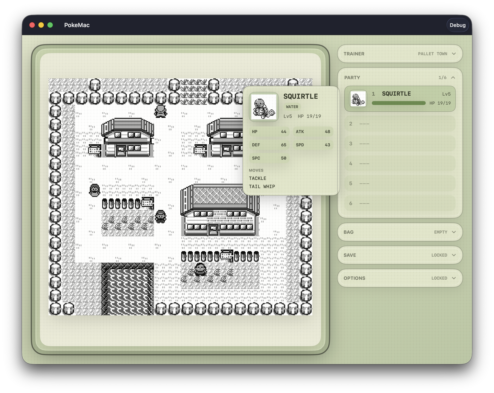

# PokeSwift



PokeSwift is a native macOS reinterpretation of Pokemon Red built in Swift.

This repository still contains the `pret/pokered` disassembly and original assets as the canonical source of truth for game data, scripts, rules, maps, text, and content coverage. The active project goal is no longer "maintain an ASM dump" by itself. The goal is to ship a fully playable macOS app from this repo using:

- a native Swift engine
- a native macOS app shell and UI
- deterministic content extracted from the disassembly
- telemetry and harness tooling that support full agentic validation loops

## Current Status

Milestones `M1` and `M2` are complete.

Today the repo includes:

- a Tuist-managed Swift workspace
- a deterministic Red content extraction pipeline
- committed extracted runtime content under `Content/Red/`
- a native macOS app that reaches `launch -> splash -> titleAttract -> titleMenu`
- telemetry, control, and harness tooling for automated validation

The Swift app now targets macOS `26.0` and later.

## Run The App

Primary commands:

```bash
./scripts/build_app.sh
./scripts/extract_red.sh
./scripts/launch_app.sh
./scripts/validate_milestone.sh
```

These scripts:

- generate the Tuist workspace
- build the Swift targets
- extract and verify Red runtime content
- launch the native app
- run telemetry-driven milestone validation

For normal app usage, `./scripts/launch_app.sh` is enough.

## Project Layout

- `App/` native macOS app host
- `Sources/PokeCore/` headless game/runtime state
- `Sources/PokeUI/` reusable SwiftUI rendering and scene components
- `Sources/PokeContent/` runtime content loading and validation
- `Sources/PokeExtractCLI/` deterministic extraction from the disassembly
- `Sources/PokeTelemetry/` runtime snapshots and control surfaces
- `Sources/PokeHarness/` build/launch/input/validation automation
- `Content/Red/` extracted runtime artifacts used by the app
- `SWIFT_PORT.md` living port ledger for full-game scope and milestone tracking

## Source Of Truth

The Swift runtime does not parse `.asm` files directly at runtime.

Instead:

1. `PokeExtractCLI` reads the disassembly and source assets from this repository.
2. It writes deterministic runtime artifacts into `Content/Red/`.
3. The native app loads those extracted artifacts.

This keeps the disassembly authoritative while letting the macOS app stay native and testable.

## Original Disassembly And ROM Builds

This repo still builds the original ROM targets:

- Pokemon Red (UE) [S][!].gb `sha1: ea9bcae617fdf159b045185467ae58b2e4a48b9a`
- Pokemon Blue (UE) [S][!].gb `sha1: d7037c83e1ae5b39bde3c30787637ba1d4c48ce2`
- BLUEMONS.GB (debug build) `sha1: 5b1456177671b79b263c614ea0e7cc9ac542e9c4`
- dmgapae0.e69.patch `sha1: 0fb5f743696adfe1dbb2e062111f08f9bc5a293a`
- dmgapee0.e68.patch `sha1: ed4be94dc29c64271942c87f2157bca9ca1019c7`

For the original assembly toolchain and ROM build setup, see [**INSTALL.md**](INSTALL.md).

## Planning And Progress

- [**SWIFT_PORT.md**](SWIFT_PORT.md) is the master engineering ledger for the Swift port.
- It tracks milestones, subsystem status, parity goals, telemetry requirements, and next steps.

## See Also

- [**Wiki**][wiki] (includes [tutorials][tutorials])
- [**Symbols**][symbols]
- [**Tools**][tools]

You can find us on [Discord (pret, #pokered)](https://discord.gg/d5dubZ3).

For other pret projects, see [pret.github.io](https://pret.github.io/).

[wiki]: https://github.com/pret/pokered/wiki
[tutorials]: https://github.com/pret/pokered/wiki/Tutorials
[symbols]: https://github.com/pret/pokered/tree/symbols
[tools]: https://github.com/pret/gb-asm-tools
